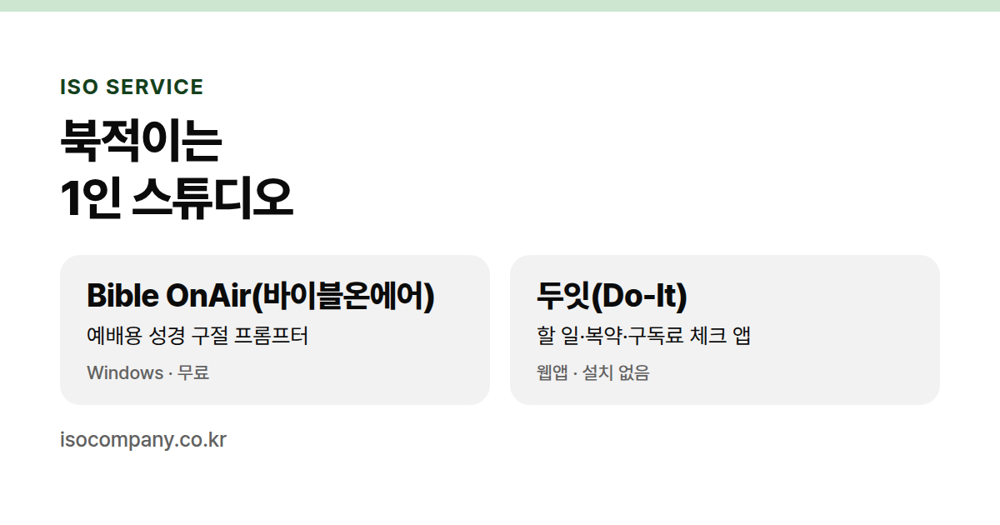
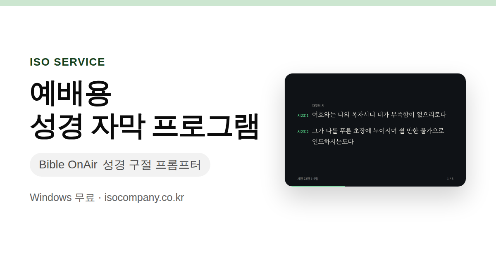
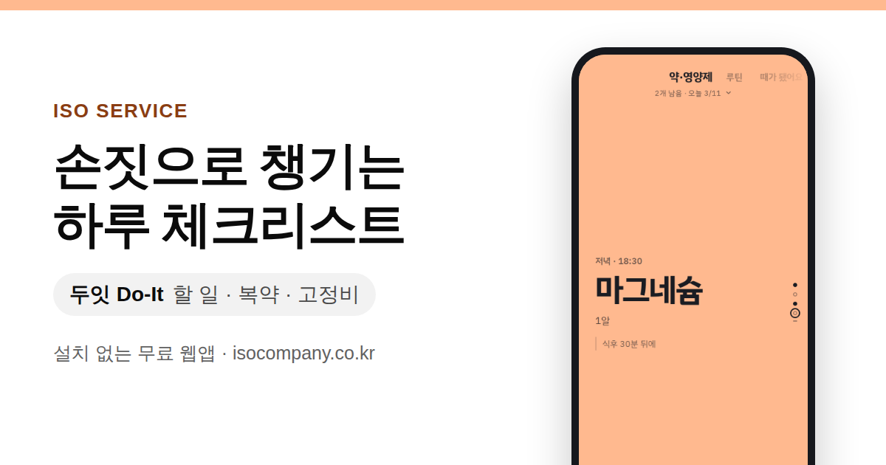

  

<h1 align="center">이소서비스</h1>

  <b>북적이는 1인 스튜디오.</b> 

  

  <a href="https://isocompany.co.kr/bible-onair/">Bible OnAir</a> &nbsp;·&nbsp;
  <a href="https://isocompany.co.kr/do-it/">두잇</a> &nbsp;·&nbsp;
  <a href="https://isocompany.co.kr/#contact">문의</a>

 

## Bible OnAir

**예배용 성경 구절 프롬프터** 

Windows 전용이며 무료(개역개정 유료, 준비중)입니다. 저작권이 소멸된 「성경전서 개역한글판」(1961)을 사용하고 있습니다.

**[소개 페이지](https://isocompany.co.kr/bible-onair/)**

 

## 두잇

**할 일·복약·구독료 체크 앱** 

약, 루틴, 구독료 등을 한 화면에 하나씩 보여줍니다. 꾹 눌러 완료하고, 위로 넘겨 다음
할 일을 챙깁니다.

설치가 필요 없습니다. 휴대폰 브라우저에서 열고 홈 화면에 추가하여 앱처럼 사용합니다.(앱 준비중)

**[소개 페이지](https://isocompany.co.kr/do-it/)**

 

## 문의

사용 중 생긴 문제나 기능 제안을 보내주세요. 확인하는 대로 답변드리겠습니다.

**hello@isocompany.co.kr**

 

---
